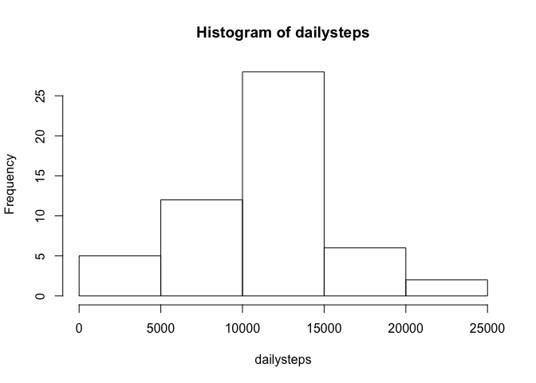
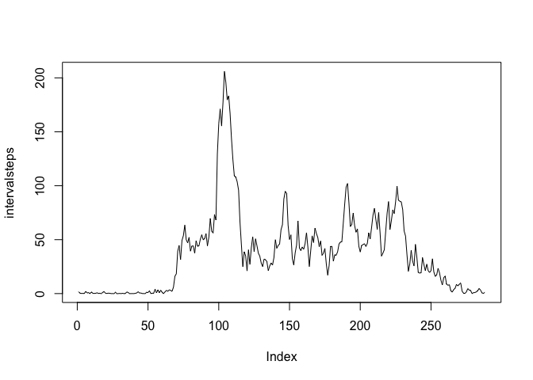
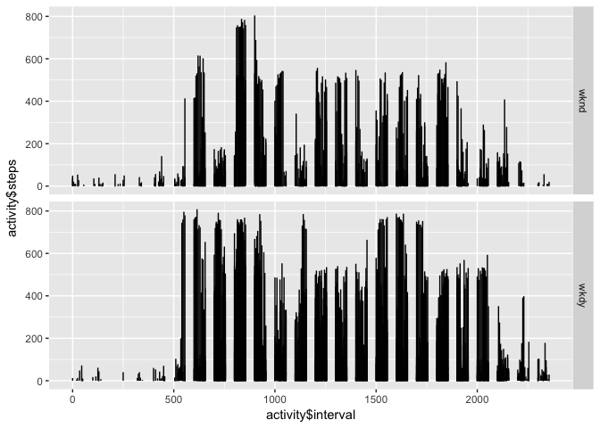

# Reproducible Research: Peer Assessment 1


## Loading and preprocessing the data

This cunk includes all the required information for downloading and reading the dataset.

1. Load the data (i.e. read.csv())

```r
temp <- tempfile()
download.file("https://d396qusza40orc.cloudfront.net/repdata%2Fdata%2Factivity.zip", temp)
activity <- read.csv(unzip(temp))
unlink(temp)
```
2. Process/transform the data (if necessary) into a format suitable for your analysis

```r
summary(activity)
```

```
##      steps                date          interval     
##  Min.   :  0.00   2012-10-01:  288   Min.   :   0.0  
##  1st Qu.:  0.00   2012-10-02:  288   1st Qu.: 588.8  
##  Median :  0.00   2012-10-03:  288   Median :1177.5  
##  Mean   : 37.38   2012-10-04:  288   Mean   :1177.5  
##  3rd Qu.: 12.00   2012-10-05:  288   3rd Qu.:1766.2  
##  Max.   :806.00   2012-10-06:  288   Max.   :2355.0  
##  NA's   :2304     (Other)   :15840
```

```r
head(activity)
```

```
##   steps       date interval
## 1    NA 2012-10-01        0
## 2    NA 2012-10-01        5
## 3    NA 2012-10-01       10
## 4    NA 2012-10-01       15
## 5    NA 2012-10-01       20
## 6    NA 2012-10-01       25
```

```r
names(activity) <- c('steps','date','interval')
activity[,'steps'] <- as.numeric(activity$steps)
```

## What is mean total number of steps taken per day?
1. Make a histogram of the total number of steps taken each day


```r
dailysteps <- tapply(activity$steps,activity$date, FUN=sum, na.omit=TRUE)
hist(dailysteps)
```

<!-- -->
2. Calculate and report the mean and median total number of steps taken per day

```r
fmean <- mean(dailysteps, na.rm=TRUE)
fmedian <- median(dailysteps, na.rm=TRUE)
```
the `mean` is 1.0767189\times 10^{4}
the `median` is 1.0766\times 10^{4}

## What is the average daily activity pattern?

1.Make a time series plot (i.e. type = "l") of the 5-minute interval (x-axis) and the average number of steps taken, averaged across all days (y-axis)

```r
intervalsteps <- tapply(activity$steps,activity$interval, FUN=mean, na.rm=TRUE)
plot(intervalsteps,type='l')
```

<!-- -->
2.Which 5-minute interval, on average across all the days in the dataset, contains the maximum number of steps?

```r
interval <- names(intervalsteps[intervalsteps == max(intervalsteps)])
```
The interval with the maximum average steps is 835

## Imputing missing values

1.Calculate and report the total number of missing values in the dataset (i.e. the total number of rows with NAs)

```r
total_missing <- sum(is.na(activity))
```
The total numver of missing values in the data set is 2304

2.Devise a strategy for filling in all of the missing values in the dataset. The strategy does not need to be sophisticated. For example, you could use the mean/median for that day, or the mean for that 5-minute interval, etc.
the activity to use will be considering NAs like 0s

```r
activityimp <- activity 
```
3.Create a new dataset that is equal to the original dataset but with the missing data filled in.
``` R
activityimp[is.na(activityimp[1]),1] <- 0
``` 
4.Make a histogram of the total number of steps taken each day and Calculate and report the mean and median total number of steps taken per day. Do these values differ from the estimates from the first part of the assignment? What is the impact of imputing missing data on the estimates of the total daily number of steps?

```r
ndailysteps <- tapply(activityimp$steps,activityimp$date, FUN=sum)
hist(ndailysteps)
```

<!-- -->

```r
nmean <- mean(ndailysteps)
nmedian <- median(ndailysteps, na.rm=TRUE)
```
the new mean is NA, NA is the difference between the first calculation and the current one.  
the new median is 1.0765\times 10^{4}, 1 is the difference between the first calculation and the current one

## Are there differences in activity patterns between weekdays and weekends?
1. Create a new factor variable in the dataset with two levels -- "weekday" and "weekend" indicating whether a given date is a weekday or weekend day.


```r
weekdays <- c('Monday', 'Tuesday', 'Wednesday', 'Thursday', 'Friday')
activity['weekday']<-as.Date(activityimp$date)
activity['weekday']<-factor((weekdays(activity$weekday) %in% weekdays), levels=c(FALSE, TRUE), labels=c('wknd', 'wkdy'))
```

2. Make a panel plot containing a time series plot (i.e. `type = "l"`) of the 5-minute interval (x-axis) and the average number of steps taken, averaged across all weekday days or weekend days (y-axis). 

```r
library("plyr")
require("ggplot2")
```

```
## Loading required package: ggplot2
```

```r
qplot(activity$interval,activity$steps, geom='line', facets=weekday~., data=arrange(activity, weekday))
```

```
## Warning: Removed 2 rows containing missing values (geom_path).
```

<!-- -->
